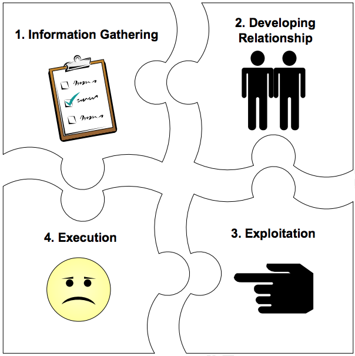

# Social Engineering
### The Human Element

By: Jean Tirstan

Polibatam Cyber

## You Can Find These Presentations Online

Visit  to find these presentations and more online!

Material: <a href="https://tldrlegal.com/license/creative-commons-attribution-sharealike-4.0-international-(cc-by-sa-4.0)">Creative Commons Attribution-ShareAlike 4.0</a>Code: <a href="https://tldrlegal.com/license/bsd-2-clause-license-(freebsd)">BSD 2-Clause</a>

## What is Social Engineering?

> Social engineering, in the context of information security, refers to psychological manipulation of people into performing actions or divulging confidential information.

## Imagine a Scenario

# Exploring the Human Mind

Adapted from:
&lt;Peltier, T. R. (2006). Social engineering: Concepts and solutions. Information Systems Security, 15(5),13-21.&gt;

## Basic Human Qualities

* The desire to be helpful and to trust people
* The fear of getting into trouble or feeling guilty
* The willingness to cut corners

## Personality Traits

* Diffusion of Responsibility
	- Employees of a large company feel their actions don't directly impact the company
* Thinking they will benefit or will impress someone else
* Not wanting to throw away a relationship with another person

# Schemes

Adapted from:
&lt;Brody, R. G., Brizzee, W. B., & Cano, L. (2012). Flying under the radar: social engineering. International Journal of Accounting & Information Management, 20(4), 335-347.&gt;

## Dumpster Diving

* Sifting through garbage to find valuable information left intact or that can be recovered
* The fourth amendment does not apply to garbage left on public property
	- See: _California v. Greenwood_

## Shoulder Surfing

* Looking over one's shoulder to steal confidential information/credentials
* Prevention
	- Cover your PIN pad entries with your hand
	- Make sure no one is pointing a camera your way
	- Make sure nobody is staring at your hands while typing passwords
	- Reduce screen viewing angles

## Tailgating

* Following someone who is credentialed through a secure checkpoint
* _Hold the door!_

## Phishing

* Masquerading as a legitimate person or service to obtain sensitive information
* Tricking users to:
	- Login to an insecure or fake form
	- Send sensitive or valuable information directly to the attackers
	- Downloading or executing malicious files
* Most popular medium for attack is email

## Phishing Scenario

<pre style="font-family: inherit;">
To: &lt;cyber@clemson.edu&gt;
From: &lt;tickets@cIemsontigers.com&gt;

Clemson Student - 

Congratulations on receiving a student ticket for the Citadel game!
Student attendance is a big part of what makes the atmosphere
on Clemson game days so special and we hope you'll join us at Memorial Stadium.
Due to rising concerns with ticket distribution and student attendance
we ask you to please visit https://cIemsontigers.com/students/confirm
and log in to confirm your attendance for the upcoming football game.

Thank you & Go Tigers!
</pre>

## Revealed Text

<pre style="font-family: monospace;">
To: &lt;cyber@clemson.edu&gt;
From: &lt;tickets@cIemsontigers.com&gt;

Clemson Student - 

Congratulations on receiving a student ticket for the Citadel game!
Student attendance is a big part of what makes the atmosphere
on Clemson game days so special and we hope you'll join us at Memorial Stadium.
Due to rising concerns with ticket distribution and student attendance
we ask you to please visit https://cIemsontigers.com/students/confirm
and log in to confirm your attendance for the upcoming football game.

Thank you & Go Tigers!
</pre>

## Pretexting

* Inventing a identity and scenario with the intention of manipulating a specific target
* Often involves creating a relationship with the victim
* Requires planning, research, and practice to be successful

# The Cycle

Adapted from:
&lt;Allen, M. (2006). Social engineering: A means to violate a computer system. SANS Institute, InfoSec Reading Room.&gt;

## 1. Information Gathering

* Gathering information about the targets to determine how to best build a relationship
* Info you may gather
	- Personal and professional contacts
	- Birth dates and other personal information
	- Likes, dislikes, and interests

## 2. Developing Relationships

* Insert yourself into their life
* Put yourself into a position of trust
	- Authority
	- Submission
	- Peer

## 3. Exploitation

* Exploiting the target by leveraging the relationship you created and any information you gathered about the target and situation

## 4. Execution

* Once the action has been completed or has failed the cycle is complete
* Pivot using newly gathered information and repeat the cycle if necessary

# Counter-Measures

## Combating Social Engineering

* Implement controls
* Regular reviews of controls
* Simulated attacks

Note:
### Security Controls:
* Have management buy-in and create a culture of security
* Physical security
* Education, awareness, and training
* Incident response strategies
* Good security policies and arcitecture throughout the organization

# Physical Security

## Why look at Physical Security?

* Physical security can provide access that social engineering can't

## Locks

* Picking the lock can give access to an area that social engineering fails to

## Door Badge Access Control

* System Clemson uses to control access to buildings and rooms
* Badges can be tricked into giving a response to a fake reader
* Transaction can be played back to the real reader to gain access
* Standard readers need to be within 3 inches

## Doors

* Hinges
* Crash bar

## Elevators

* Large corporations often use elevators as access controls to entire floors
* Bypass badge control to unlock floors
* Use independent service key
* Use fire key

# Tooling

## Phishing vs Spear Phishing 

* Phishing is a wide net cast across an entire organization
* Spear Phishing is targeted against a single user

## SE Frameworks

* GoPhish
* SET

## GoPhish

Open-Source Phishing Framework

https://getgophish.com/

## GoPhish usage

* Run an spear phishing campaign against targets inside a corparation
* Simple to set up, can be setup with a template, landing page, and a listening URL

## Social Engineering Toolkit (SET)

"Specifically designed to perform advanced attacks against the human element"

https://www.social-engineer.org/framework/se-tools/computer-based/social-engineer-toolkit-set/

# Questions?
